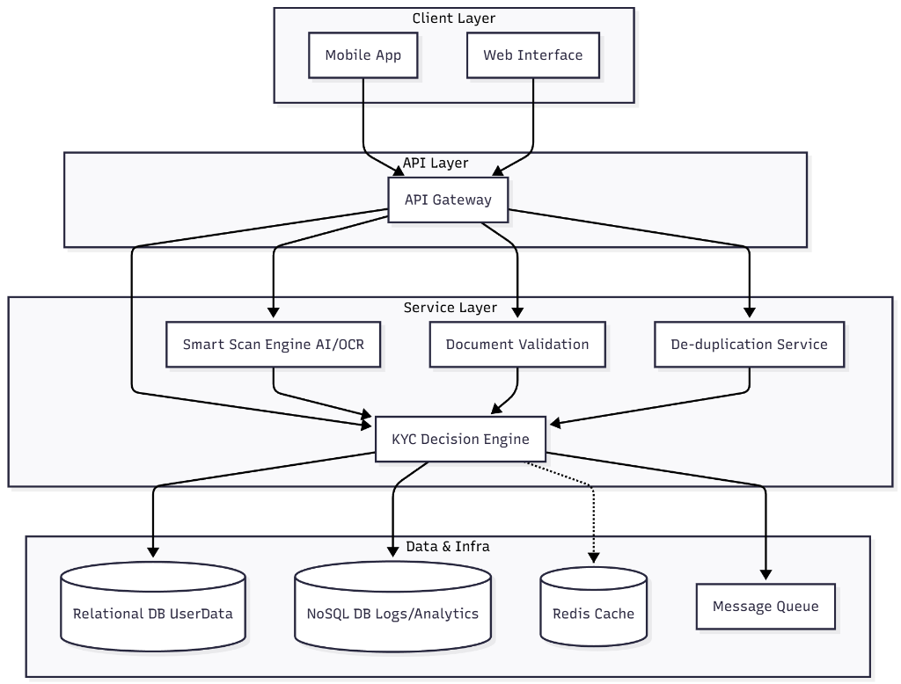
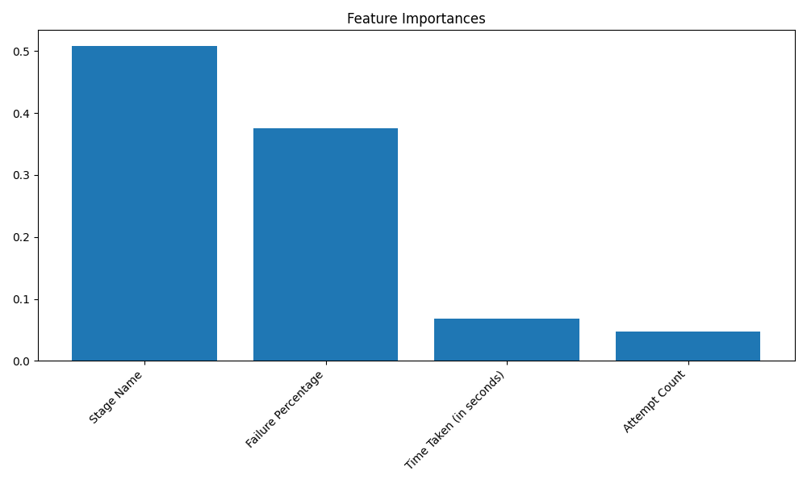

# HDFC Bank-Style Digital KYC System

> [!IMPORTANT]
> **Project Status: Preparatory Phase (Proof of Work)**
> This project is currently in the preparatory phase to demonstrate the technical capabilities and innovative features of the proposed Digital KYC solution. The live deployment serves as a proof of work for evaluation purposes.

## 🚀 Live Demo
- **Frontend (Client):** [https://frontend-5tokfa2vx-danielahmeeds-projects.vercel.app/](https://frontend-5tokfa2vx-danielahmeeds-projects.vercel.app/)
- **Backend (API):** [https://capstone-1-kyc-hdfc-1.onrender.com](https://capstone-1-kyc-hdfc-1.onrender.com)

> **Note:** The backend is hosted on a free tier service (Render), so it may take a minute to wake up on the first request. Please be patient!

## Problem Statement & Business Context
In the digital banking era, a seamless KYC (Know Your Customer) process is critical for customer acquisition. High drop-off rates during KYC are a significant revenue leak for banks. This project addresses the challenge of **reducing customer drop-off and lifting conversion rates** by implementing a robust, user-centric, and AI-powered Digital KYC solution.

**Key Business Goals:**
- **Minimize Friction:** Streamline the onboarding process to reduce time-to-completion.
- **Enhance Security:** Prevent fraud using advanced biometric and document verification.
- **Maximize Conversion:** Recover dropped-off users through "Resume KYC" and proactive AI support.
- **Data-Driven Insights:** Utilize machine learning to identify and rectify bottlenecks in the user journey.

This repository contains a complete implementation of this solution, inspired by HDFC Bank's standards, featuring advanced security, scalability, and a comprehensive user experience.

## Project Structure

```
prob1/
├── Data-analysis/              # Data analysis scripts and models
│   ├── analyze_data.py         # Data analysis script
│   ├── model_data.py           # ML model training script
│   ├── inspect_columns.py      # Column inspection utility
│   ├── *.png                   # Analysis visualizations
│   └── *.docx/xlsx             # Analysis reports and raw data
├── kyc-client/                 # React frontend application
│   ├── public/                 # Static assets
│   ├── src/                    # Source code
│   │   ├── components/         # React components
│   │   │   ├── DocumentScanner.css/js     # Document scanning functionality
│   │   │   ├── ErrorRecovery.css/js       # Error handling and recovery
│   │   │   ├── FacialRecognition.css/js   # Facial recognition components
│   │   │   ├── KYCDashboard.css/js       # Analytics dashboard
│   │   │   ├── KYCProgress.css/js        # Progress tracking
│   │   │   ├── Login.css/js              # Authentication
│   │   │   └── SupportAssistant.css/js   # 24/7 AI support assistant
│   │   ├── services/           # API services
│   │   │   └── api.js         # Backend API communication
│   │   ├── App.css            # Main application styles
│   │   ├── App.js             # Main application component
│   │   ├── index.css          # Global styles
│   │   └── index.js           # Application entry point
│   ├── package.json           # Frontend dependencies
│   └── README.md              # Frontend documentation
├── server/                    # Node.js backend server
│   ├── db.js                 # Database operations
│   ├── index.js              # Server entry point
│   ├── kyc.db                # SQLite database
│   ├── package.json          # Backend dependencies
│   └── eng.traineddata       # Tesseract OCR data
├── DIGITAL_KYC_SOLUTION.md   # Complete solution documentation
├── FINAL_SUMMARY.md          # Final project summary
├── IMPLEMENTATION_SUMMARY.md # Technical implementation details
├── INFRASTRUCTURE.md         # Scalability and infrastructure details
├── README.md                 # This file
├── SECURITY.md               # Security implementation details
├── SUPPORT_SYSTEM.md         # 24/7 support system documentation
└── setup.js                 # Initial setup script
```

## System Architecture



## Innovative Solution Design & Features

### 1. Step-by-Step Guided KYC Flow
- Multi-step process with clear instructions at each stage
- Tooltips and validation for Personal Info, PAN Upload, Aadhaar OTP, Face Match, and Final Review
- Proper user feedback for validation errors

### 2. Resume KYC Option
- Local storage persistence for immediate recovery
- Backend checkpointing for cross-device resume capability
- Automatic saving of progress at each step

### 3. Load Balancing & Scalability
- Horizontal scaling with multiple application instances
- Vertical scaling through resource allocation
- Auto-scaling groups for dynamic load management
- Request distribution via NGINX reverse proxy

### 4. Auto-Scaling & Fault Tolerance
- Health check mechanisms
- Retry mechanisms with exponential backoff
- Circuit breaker pattern for service resilience
- Graceful fallback strategies

### 5. Security Measures
- JWT-based authentication with secure token handling
- Data encryption for sensitive fields
- Secure image upload and validation
- Rate limiting and IP monitoring
- Tamper-proof audit logs

### 6. KYC Failure Analysis Dashboard
- Visualization of KYC failure points
- Upload failures counter
- OTP verification statistics
- Face matching success rates
- Daily/weekly success ratio trends

### 7. Review Before Final Submission
- Comprehensive review screen showing all entered data
- Document previews with quality scores
- Edit functionality for any step

### 8. Recovery & Error Handling
- "Try Again" functionality for failed operations
- State recovery mechanisms
- Auto-retry for failed API calls
- Detailed error logging

### 9. 24/7 AI-Guided Support System
- Always-available AI assistant with step-specific guidance
- Contextual error recovery with troubleshooting tips
- Direct access to human support agents
- Interactive chat system

### 10. Camera-Based Document Scanning
- Real-time camera access for document capture
- Instant scanning functionality
- Image processing and quality validation

## Data Analysis & Insights
To ensure the solution effectively addresses the drop-off problem, we performed a rigorous data analysis on KYC failure patterns.

### Methodology
We utilized a **Random Forest Classifier** to analyze historical KYC data and identify the primary factors contributing to user drop-off. The model achieved high accuracy in predicting KYC success/failure based on interaction metrics.

### Key Findings
Our analysis revealed that **Stage Name** and **Failure Percentage** are the most critical predictors of KYC success. This insight drove our decision to implement a **Step-by-Step Guided Flow** and **Real-time Error Recovery**, ensuring users are supported exactly when they are most likely to fail.

#### Feature Importance
The chart below highlights the factors that most significantly impact the KYC outcome.


#### Failure Distribution by Stage
Understanding where users fail allows us to target specific improvements.


#### Failure Percentage Analysis


## Technology Stack

### Frontend
- React.js with modern hooks
- Responsive CSS for cross-device compatibility
- Tesseract.js for OCR capabilities

### Backend
- Node.js with Express framework
- SQLite for data storage
- Sharp.js for image processing
- JSON Web Tokens for authentication

### Security
- Helmet.js for HTTP header security
- Bcrypt for password hashing
- Morgan for request logging

## Database Schema

The system uses SQLite with the following tables:
1. **Users Table**: Stores user information and document details
2. **Biometric Fingerprints Table**: Stores facial recognition templates
3. **KYC Attempts Table**: Logs all KYC attempts for analytics

## API Endpoints

- Authentication: POST `/api/auth/login`
- KYC Operations: Multiple endpoints for document scanning, facial recognition, duplicate checking, Aadhaar verification, and submission
- Analytics: GET `/api/kyc/dashboard` for dashboard data

## Security Features

- End-to-end JWT-based authentication
- Rate limiting to prevent abuse
- Input validation and sanitization
- Secure file upload handling
- Tamper-proof audit logging

## Scalability Features

- Load balancing configuration examples
- Auto-scaling policies
- Health monitoring endpoints
- Caching mechanisms

## Deployment Recommendations

- Docker containerization for consistent deployment
- Kubernetes orchestration for auto-scaling
- Redis caching for improved performance
- Load balancer for traffic distribution
- SSL termination at the edge

## Running the Application

1. Clone the repository
2. Install dependencies for both client and server:
   ```
   cd server && npm install
   cd ../kyc-client && npm install
   ```
3. Start the backend server:
   ```
   cd server && npm start
   ```
4. Start the frontend client:
   ```
   cd kyc-client && npm start
   ```

The application will be available at `http://localhost:3000`.

## Documentation Files

- `DIGITAL_KYC_SOLUTION.md`: Complete solution documentation
- `FINAL_SUMMARY.md`: Final project summary
- `IMPLEMENTATION_SUMMARY.md`: Technical implementation details
- `INFRASTRUCTURE.md`: Scalability and infrastructure details
- `SECURITY.md`: Security implementation details
- `SUPPORT_SYSTEM.md`: 24/7 support system documentation
- [Project Presentation (Google Slides)](https://docs.google.com/presentation/d/1OUI4BpJ4jRCmb8ijHw6F4JLVa9QxtLfrQcKWu6x6IrY/edit?usp=sharing)

## Contributing

Contributions are welcome! Please fork the repository and submit pull requests with your improvements.

## License

This project is licensed under the MIT License - see the LICENSE file for details.